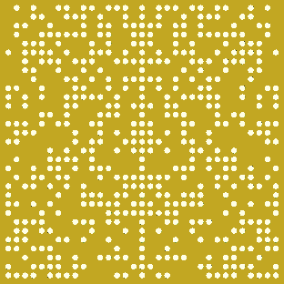
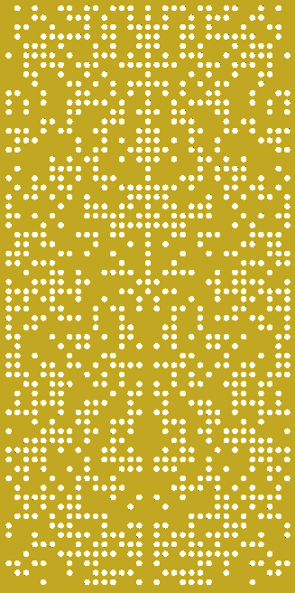

# bad dude
  

This [OpenSCAD](https://openscad.org/) module renders binary amplitude diffusor (BAD) patterns that can be exported to an appropriate file format for a CAD-based CNC machine.

This project was inspired by Bill Collison's [qrdude](https://www.subwoofer-builder.com/qrdude.htm).

**Usage**

Load `bad.scad` into OpenSCAD and click the render icon.  Once rendering is complete, select File->Export to save to the appropriate format (.dxf, .pdf, .svg, etc).

**Description**

The module reads the file `pattern.scad` as input.  The included pattern is the same one as in the original [patent](https://patents.google.com/patent/US5817992A/en).  It originated from a spreadsheet posted in a long and informative thread at [gearspace](https://gearspace.com/board/bass-traps-acoustic-panels-foam-etc/459885-rpg-bad-panel-detailed-plans.html).

There are variables to set the dimensions of the board, border around the edges, and size of the holes.  The module will evenly space the holes within the given tableau.

The `mirroring` boolean variable at the top of the file determines if the panel will be doubled in height vertically.  This is suitable for mounting over a 24"x48" Owens Corning 703 panel, for example.  If set to `true`, then by default the pattern will be copied in inverse (where the holes and reflective areas are transposed) as seen in the image to the right.  You can experiment with other mirror patterns by changing the boolean conditions in the code.  Set `mirroring` to `false` to generate a 24"x24" pattern as seen in the topmost image.
